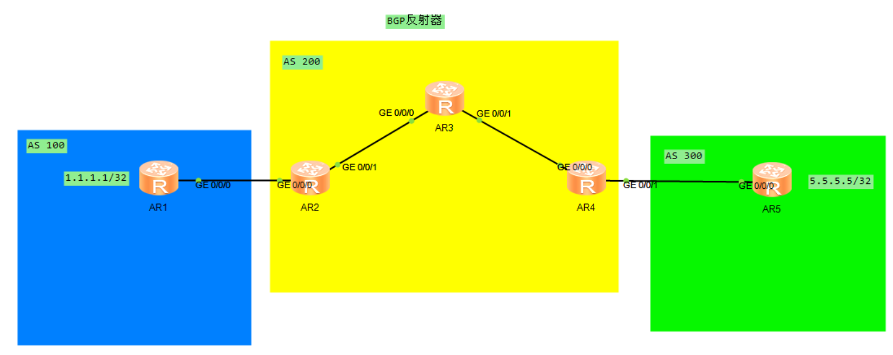
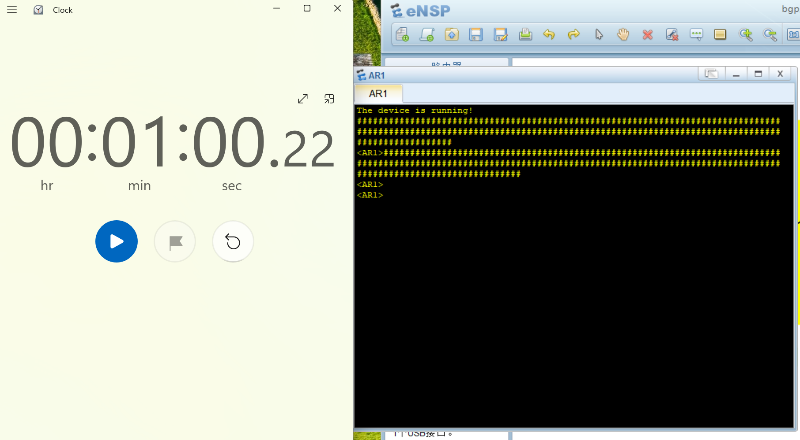

整体拓扑图



目的是使得AR1上的loopback0接口地址(1.1.1.1)可以ping通AR5上的的loopback0接口地址(5.5.5.5)

黄色区域回运行ospf协议


下面是AR3上有关反射器的配置

```
bgp 200
 peer 2.2.2.2 as-number 200 
 peer 2.2.2.2 connect-interface LoopBack0
 peer 4.4.4.4 as-number 200 
 peer 4.4.4.4 connect-interface LoopBack0
 #
 ipv4-family unicast
  undo synchronization
  peer 2.2.2.2 enable
  peer 2.2.2.2 reflect-client
  peer 4.4.4.4 enable
  peer 4.4.4.4 reflect-client
```


测试了一下AR路由器启动的时长，大概是1分钟。

